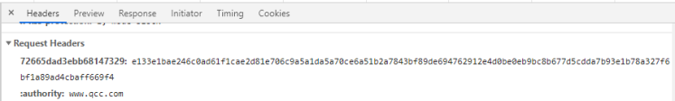
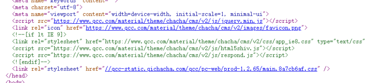
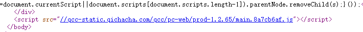
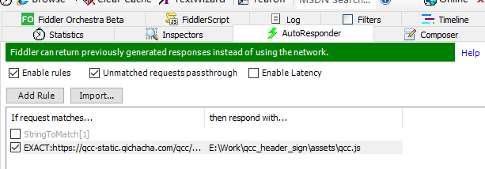
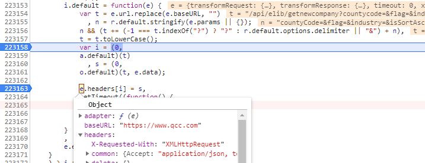
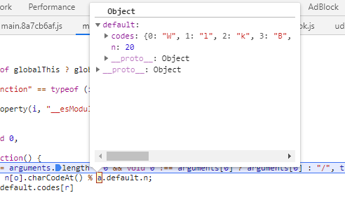
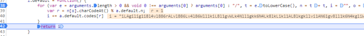
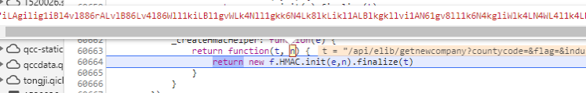

# qcc请求头反爬破解

最近有朋友问我，[qcc](https://www.qcc.com/web/elib/newcompany) 网站做了一次反爬措施，要如何破解。


## 分析


我抓包大致看了下，该模块下的请求为 `ajax`请求，并且每次请求都会带上一个疑似身份验证的请求头，长这个样子：



首先搜索网页 `html` 源码，无法得知该信息从何来，前面的请求也没有带，基本上可以断定是 `js` 动态生成并带上请求头，和后端交互的。


既然确定了，就开始找找是哪段 `js` 代码。查看 `html` 代码，该页面只加载了几个 `js` 文件：





不出意外的话， `jquery` 可以先不管，那就先看下面的文件。搜索关键词 `newcompany` 可以大概确定就是它了。因为该网站为了防止别人前端做 `debug` ，在该 `js` 文件中加了大量的 `debug` 断点。这个时候我们可以使用抓包工具 `filder` 做本地代理，在网站加载请求该 `js` 文件时，使用本地文件返回给网站。这样就可以将原来的 `js` 文件中的断点代码全部删掉，方便正常的调试。


## 调试


`filder` 的 `AutoResponder` 标签，点击添加规则，将左侧该  `main.8a7cb6af.js`  文件拖到右边，如下图设置即可：



接着刷新网页，便不会再有无限的断点了。这个时候就可以开始调试代码，找到请求头开始生成的位置，以及生成的逻辑。


前端调试很枯燥，根据关键词，一步一步往下走，可以看到关键代码，如下：



关键代码：
```javascript
var i = (0,
a.default)(t)
, s = (0,
o.default)(t, e.data);

e.headers[i] = s,
```
翻成人看的代码：


```javascript
var i = a.default)(t), s = o.default(t, e.data)

e.headers[i] = s
```
跟着往前看调用栈，这里的 `e` 就是后面带上请求头的元素。那么这里的 `i` 和 `v` 就是我们需要的。
跟着往下走，看这两个值时如何生成的。


上图即是关键逻辑，用来生成初始的值。这里翻译过来就是：
```javascript
var e = '/api/elib/getnewcompany?countycode=&flag=&industry=&issortasc=false&pagesize=20&province=&sortfield=startdate&startdateend=',
    t = e,
    n = t + t,
    i = ""
for (o=0; o<n.length; o++) {
	var r = n[o].charCodeAt() % a.default.n;
  i += a.default.codes[r]
}
return i
```
这里的 `a.default` 是固定值：



这样的话，直接看最后返回的值：



### Python翻译
```python
def o():
    arguments = ["/api/elib/getnewcompany?countycode=&flag=&industry…ze=20&province=&sortfield=startdate&startdateend="]
    e = arguments[0]
    t = e.lower()
    n = t + t
    i = ""
    codes = {
        0: "W",
        1: "l",
        2: "k",
        3: "B",
        4: "Q",
        5: "g",
        6: "f",
        7: "i",
        8: "i",
        9: "r",
        10: "v",
        11: "6",
        12: "A",
        13: "K",
        14: "N",
        15: "k",
        16: "4",
        17: "L",
        18: "1",
        19: "8",
    }
    _n = 20
    for o in range(len(n)):
        r = ord(n[o]) % _n
        i += codes[r]
    print(i)
```
输出的结果似乎和需要的不太一样，只能继续往下走==！。


## hmac
到了下图的位置，该网站前端 `js` 生产请求的逻辑以经很清晰了，这里使用了 `Hmac` 算法，对上面生成的一串字符做了哈希处理。



`python` 标准库中实现了该算法，可以直接调用。


## 总结

1. QCC 网站该模块前端限制 debug，可通过 filder 设置代理替换网站加载的 js 文件
1. js 文件格式化后有 30w 行，搜索关键词，一步步往下调试，找到关键代码
1. 需要知道 hmac 算法的存在，不要盲目往下调试

完整代码可以参考：[qcc_header_sign](https://github.com/Blackyukun/qcc_header_sign) 


## 声明

- 本仓库发布的脚本，仅用于测试和学习研究，禁止用于商业用途，不能保证其合法性，准确性，完整性和有效性，请根据情况自行判断。
- 本项目内所有资源文件，禁止任何公众号、自媒体进行任何形式的转载、发布。
- 如果任何单位或个人认为该项目的脚本可能涉嫌侵犯其权利，则应及时通知并提供身份证明，所有权证明，将在收到认证文件后删除项目。

